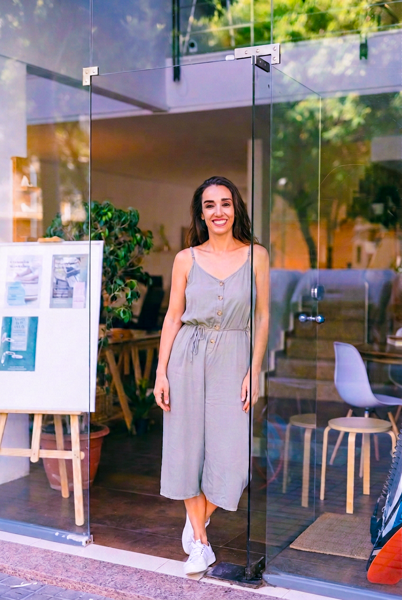
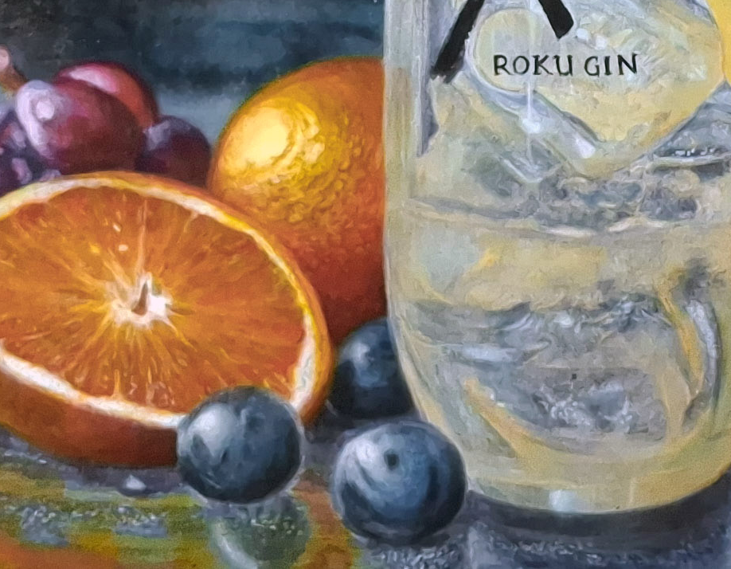
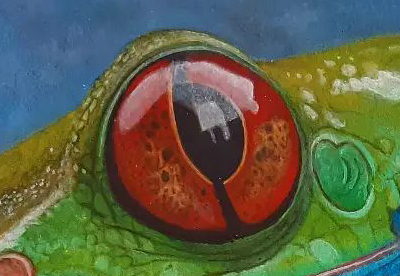
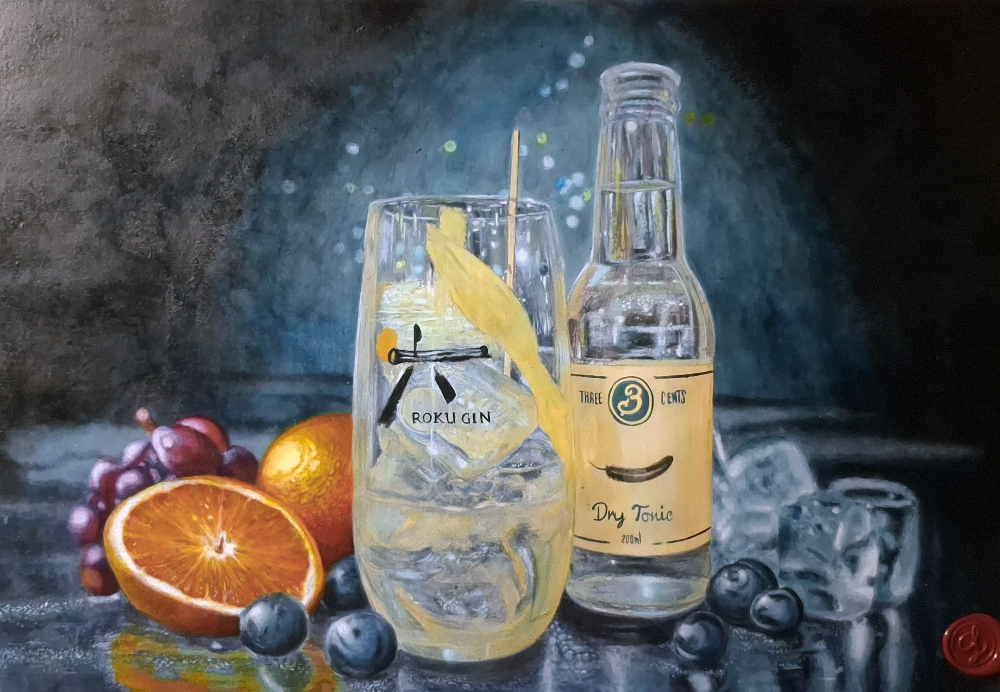
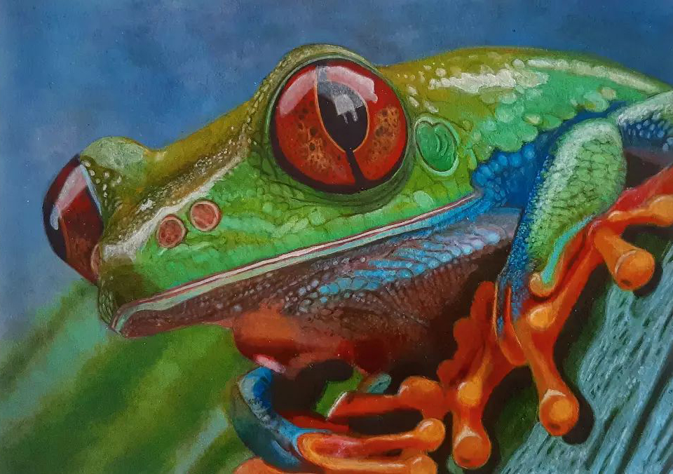
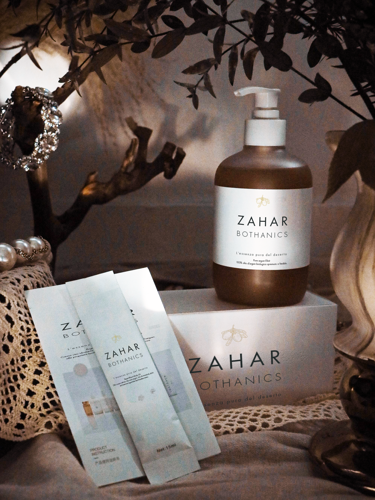
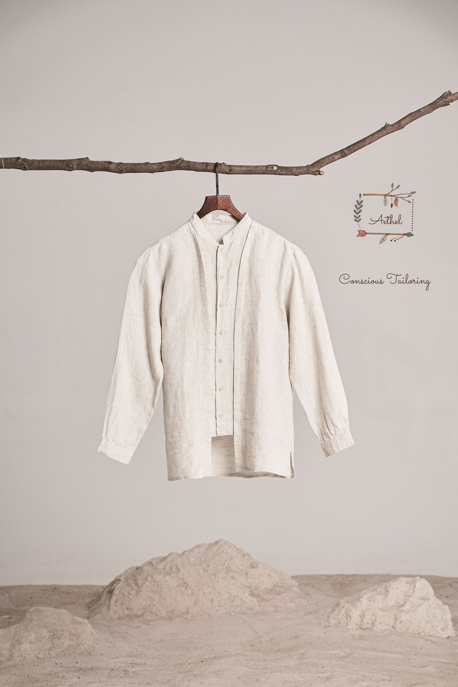

<html lang="it" class="scroll-smooth">
<head>
    <meta charset="UTF-8">
    <meta name="viewport" content="width=device-width, initial-scale=1.0">
    <title>Laura Macchi | Visual Artist & Graphic Designer</title>
    
    <!-- Tailwind CSS -->
    
    <!-- Lucide Icons -->
    
    
    <!-- Google Fonts: Cormorant Garamond & Plus Jakarta Sans -->
    <link rel="preconnect" href="https://fonts.googleapis.com">
    <link rel="preconnect" href="https://fonts.gstatic.com" crossorigin>
    <link href="https://fonts.googleapis.com/css2?family=Cormorant+Garamond:ital,wght@0,300;0,400;0,500;0,600;0,700;1,400;1,600&family=Plus+Jakarta+Sans:wght@300;400;500;600;700&display=swap" rel="stylesheet">

    

    
</head>
<body class="selection:bg-gallery-dark selection:text-gallery-bg flex flex-col justify-between min-h-screen">

    <!-- NAVIGATION HEADER -->
    <header class="fixed top-0 left-0 w-full z-40 bg-[#FBF9F5]/90 backdrop-blur-md editorial-border-b transition-all duration-300">
        

            
            <!-- Brand Mark -->
            <a href="#" class="group flex flex-col">
                
                    Laura Macchi
                
                
                Visual Artist &amp; Graphic Design
            </a>

            <!-- Desktop Links -->
            <nav class="hidden md:flex items-center gap-10 text-xs tracking-[0.18em] uppercase font-medium text-gallery-muted">
                <a href="#progetti" class="hover:text-gallery-dark transition-colors">Progetti</a>
                <a href="#visione" class="hover:text-gallery-dark transition-colors">Visione</a>
                <a href="#studio" class="hover:text-gallery-dark transition-colors">Lo Studio</a>
                <a href="#contatti" class="hover:text-gallery-dark transition-colors">Contatti</a>
            </nav>

            <!-- Behance External Link -->
            

                <a href="https://www.behance.net/lauramacchi4" target="_blank" rel="noopener noreferrer"
                   class="inline-flex items-center gap-2 text-xs uppercase tracking-widest font-semibold px-4 py-2 border border-gallery-dark/20 hover:border-gallery-dark text-gallery-dark transition-all rounded-full">
                    Behance
                    <i data-lucide="arrow-up-right" class="w-3.5 h-3.5"></i>
                </a>
            

            <!-- Mobile Toggle -->
            <button id="mobile-toggle" aria-label="Menu Mobile" class="md:hidden text-gallery-dark p-2">
                <i data-lucide="menu" class="w-6 h-6"></i>
            </button>
        

        <!-- Mobile Drawer -->
        

            <a href="#progetti" class="block text-sm uppercase tracking-widest font-medium py-2 text-gallery-dark mobile-link">Progetti</a>
            <a href="#visione" class="block text-sm uppercase tracking-widest font-medium py-2 text-gallery-dark mobile-link">Visione</a>
            <a href="#studio" class="block text-sm uppercase tracking-widest font-medium py-2 text-gallery-dark mobile-link">Lo Studio</a>
            <a href="#contatti" class="block text-sm uppercase tracking-widest font-medium py-2 text-gallery-dark mobile-link">Contatti</a>
            

                <a href="https://www.behance.net/lauramacchi4" target="_blank" class="inline-flex items-center gap-2 text-xs uppercase tracking-widest font-bold text-gallery-accent">
                    Vedi Portfolio su Behance
                    <i data-lucide="external-link" class="w-4 h-4"></i>
                </a>
            

        

    </header>
	
    <!-- HERO SECTION -->
    <section class="pt-36 sm:pt-44 pb-20 px-6 sm:px-10 max-w-7xl mx-auto">
        

            
            <!-- Hero Left Typography -->
            

                
                

                    
                    Studio d'Arte & Graphic Design
                

                <h1 class="text-4xl sm:text-6xl xl:text-7xl font-serif font-light text-gallery-dark leading-[1.08] tracking-tight">
                    Equilibrio visivo,  
                    pittura d'autore  
                    e marca contemporanea.
                </h1>

                

                    Mi presento!
					Sono una grafica pubblicitaria e visual designer con la passione per l'arte.
					Ho intrapreso lo studio dell'arte fin da bambina, continuando con la laurea in Conservazione dei beni culturali, in ambito storico artistico medievale e bizzantino.
					Negli anni successivi mi sono impegnata in un corso di arte del Maestro Enrico Massa, storico disegnatore per la Sergio Bonelli Editore, che mi ha insegnato la cura del dettaglio e l'arte del racconto visivo.
					Attraverso questo spazio condivido alcuni dei miei progetti e delle collaborazioni.
                

                <!-- Action Links -->
                

                    <a href="#progetti" class="inline-flex items-center gap-3 px-7 py-4 bg-gallery-dark text-gallery-bg text-xs uppercase tracking-widest font-semibold hover:bg-gallery-accent transition-colors rounded-full">
                        Esplora il Portfolio
                        <i data-lucide="arrow-down" class="w-4 h-4"></i>
                    </a>

                    <a href="#contatti" class="inline-flex items-center gap-2 text-xs uppercase tracking-widest font-semibold text-gallery-dark hover:text-gallery-accent transition-colors group">
                        Inizia un Progetto
                        <i data-lucide="arrow-right" class="w-4 h-4 group-hover:translate-x-1 transition-transform"></i>
                    </a>
                

                <!-- Studio Meta Grid -->
                

                    

                        01
                        Branding & Gin
                    

                    

                        02
                        Fine Art & Natura
                    

                    

                        03
                        Editorial Design
                    

                

            

            <!-- Hero Right Editorial Showcase -->
            

                

                    
                    <!-- Decorative Vignette Card -->
                    

                        
                        <!-- Hero Highlight Image (Studio Photo) -->
                       

   

                        <!-- Fine Caption -->
                        

                            Laura Macchi nel suo Atelier
                            2026 Edition
                        

                    

                

            

        

    </section>

    <!-- PORTFOLIO SECTION -->
    <section id="progetti" class="py-24 editorial-border-t bg-gallery-bg">
        

            
            <!-- Section Header & Filter Tabs -->
            

                

                    Selezione Lavori
                    <h2 class="text-3xl sm:text-5xl font-serif font-light text-gallery-dark mt-2">Galleria delle Opere</h2>
                

                <!-- Minimalist Filter Bar -->
                

                    <button class="filter-tab active py-1 transition-colors" data-filter="all">
                        Tutti i Lavori
                    </button>
                    <button class="filter-tab py-1 transition-colors hover:text-gallery-dark" data-filter="branding">
                    Branding &amp;Logo</button>
                    <button class="filter-tab py-1 transition-colors hover:text-gallery-dark" data-filter="illustrazione">
                        Illustrazione
                    </button>
                    <button class="filter-tab py-1 transition-colors hover:text-gallery-dark" data-filter="pittura">
                        Pittura Realistica
                    </button>
                

            

            <!-- Gallery Grid -->
            

                
                <!-- PROJECT 1: Sapore di Mare Gin -->
                

                    
                    

                        

                      

                            

                                Palette &amp; Studio Visivo

Esplora il Progetto Completo ↗

                            

                        

                    

                    

                        

                            ARREDO &amp; RISTORAZIONE&nbsp;
                            <h3 class="text-2xl font-serif text-gallery-dark group-hover:text-gallery-accent transition-colors mt-0.5">
                                Sapore di Mare — Spirito "Gin"
                            </h3>
                      

                        <!-- Color Palette Indicators -->
                        

                            
                            
                            
                        

                    

                

                <!-- PROJECT 2: Rana dagli occhi rossi -->
                

                    
                    

                        

                        

                            

                                Studio di Precisione
                                
Visualizza Dettagli Tecnici ↗

                            

                        

                    

                    

                        

                            Naturalismo & Pittura
                            <h3 class="text-2xl font-serif text-gallery-dark group-hover:text-gallery-accent transition-colors mt-0.5">
                                Espressione Naturale — Tree Frog
                            </h3>
                        

                        

                            
                            
                            
                        

                    

                

				<!-- PROJECT 3: Zahar Bothanics -->
                

                    
                    

                        

                      

                            

                                Palette &amp; Studio Visivo

Esplora il Progetto Completo ↗

                            

                        

                    

                    

                        

                            Brand identity &amp; Packaging&nbsp;
                            <h3 class="text-2xl font-serif text-gallery-dark group-hover:text-gallery-accent transition-colors mt-0.5">
                            Zahar Bothanics — Essenze di Argan&nbsp;&nbsp; </h3>
                      

                        <!-- Color Palette Indicators -->
                        

                            
                            
                            
                        

                    

                

                <!-- PROJECT 4: Aethel -->
                

                    
                    

                        

                        

                            

                                Studio di Precisione
                                
Visualizza Dettagli Tecnici ↗

                            

                        

                    

                    

                        

                            brand identity &amp; recycle brand
                            <h3 class="text-2xl font-serif text-gallery-dark group-hover:text-gallery-accent transition-colors mt-0.5">
                          Aethel — Conscious Tailoring&nbsp; </h3>
                        

                        

                            
                            
                            
                        

                    

                

							
                <!-- PROJECT 3: Atelier Brand Identity -->
                

                    
                    

                        

                            Editoriale &amp; marketing
                            <h3 class="text-3xl sm:text-5xl font-serif text-gallery-dark leading-tight">
                            Campagne Pubblicitarie &amp; Comunicazione&nbsp;</h3>
                            

                          Sistemi di comunicazione integrata per marchi,&nbsp; &nbsp; enogastronomia, arte ed eventi d'élite.

                        

                        

                            <i data-lucide="arrow-up-right" class="w-8 h-8"></i>
                        

                    

                

            

            <!-- External Behance Banner -->
            

                

                    Archivio Completo
                    <h3 class="text-2xl sm:text-3xl font-serif text-gallery-dark">Esplora tutti i progetti su Behance</h3>
                

                <a href="https://www.behance.net/lauramacchi4" target="_blank" rel="noopener noreferrer" 
                   class="px-8 py-4 bg-gallery-dark text-gallery-bg text-xs uppercase tracking-widest font-semibold hover:bg-gallery-accent transition-colors rounded-full whitespace-nowrap">
                    Visita behance.net/lauramacchi4
                </a>
            

        

    </section>

    <!-- PHILOSOPHY & STUDIO SECTION -->
    <section id="visione" class="py-24 editorial-border-t bg-gallery-bg">
        

            

                
                

                    Filosofia Creativa
                    
                    <h2 class="text-3xl sm:text-5xl font-serif font-light text-gallery-dark leading-snug">
                        "Un'immagine eccellente non comunica solo un messaggio; ne crea la memoria."
                    </h2>

                    

                        

                            Nel mio studio la grafica ed il disegno figurativo non sono entità separate, ma elementi complementari. Ogni bozzetto parte da uno studio attento della luce, dei pigmenti e della geometria compositiva.
                        

                        

                      Che si tratti di un’illustrazione per un’etichetta di pregio come una crema all'Argan,&nbsp; di un opera d'arredo&nbsp; enogastronomica o di un’opera naturalistica, il processo è sempre incentrato sulla ricerca dell'eleganza senza tempo.

                    

                    

                        

                            Precisione Cromatica
                            Studio meticoloso di palette e riflessi.
                        

                        

                            Approccio Sartoriale
                            Ogni progetto è unico e non replicabile.
                        

                    

                

                

                    

                        <h3 class="text-2xl font-serif text-gallery-dark">Aree di Competenza</h3>
                        
                        <ul class="space-y-4 text-xs tracking-widest uppercase font-medium text-gallery-dark">
                            <li class="flex items-center justify-between pb-3 editorial-border-b">
                                01. Visual Branding & Strategy
                                Identità Visiva
                            </li>
                            <li class="flex items-center justify-between pb-3 editorial-border-b">
                                02. Fine Art & Illustrazione
                                Pittura &amp; Natura
                            </li>
                            <li class="flex items-center justify-between pb-3 editorial-border-b">
                                03. Packaging & Etichette Premium
                                Food &amp; beauty&nbsp;
                            </li>
                            <li class="flex items-center justify-between pb-3 editorial-border-b">
                                04. Direzione Artistica & Layout
                                Editoria
                            </li>
                        </ul>
                    

                

            

        

    </section>

    <!-- CONTACT SECTION -->
    <section id="contatti" class="py-24 editorial-border-t bg-gallery-bg">
        

            

                
                <!-- Left Info -->
                

                    

                        Contatti
                        <h2 class="text-4xl sm:text-6xl font-serif font-light text-gallery-dark mt-2">Iniziamo un Progetto</h2>
                    

                    

                        Se sei interessato a sviluppare un’identità visiva d'impatto, commissionare un’illustrazione o collaborare ad un nuovo marchio, invia un messaggio.
                    

                    

                        

                            Email Studio
                            

                                laura.macchi.grafica@gmail.com
                                <button onclick="copyEmail()" class="text-xs uppercase tracking-wider text-gallery-accent hover:underline font-semibold">
                                    Copia
                                </button>
                            

                        

                        

                            Portfolio Esterno
                            <a href="https://www.behance.net/lauramacchi4" target="_blank" class="font-serif text-lg text-gallery-dark hover:text-gallery-accent transition-colors block mt-1">
                                behance.net/lauramacchi4 ↗
                            </a>
                        

                    

                

                <!-- Form Right -->
                

                    <form onsubmit="handleContact(event)" class="space-y-8 bg-gallery-card p-8 sm:p-12 rounded-2xl border border-gallery-border">
                        
                        

                            

                                <label for="form-name" class="text-[10px] uppercase tracking-widest font-semibold text-gallery-muted block">Nome & Cognome</label>
                                <input type="text" id="form-name" required placeholder="Es. Mario Rossi" 
                                       class="w-full bg-transparent text-gallery-dark focus:outline-none text-sm font-medium placeholder-gallery-muted/50">
                            

                            

                                <label for="form-email" class="text-[10px] uppercase tracking-widest font-semibold text-gallery-muted block">Indirizzo Email</label>
                                <input type="email" id="form-email" required placeholder="mario@esempio.it" 
                                       class="w-full bg-transparent text-gallery-dark focus:outline-none text-sm font-medium placeholder-gallery-muted/50">
                            

                        

                        

                            <label for="form-type" class="text-[10px] uppercase tracking-widest font-semibold text-gallery-muted block">Tipologia di Incarico</label>
                            <select id="form-type" class="w-full bg-transparent text-gallery-dark focus:outline-none text-sm font-medium">
                                <option value="branding">Identità di Marca / Packaging Food & Wine</option>
                                <option value="pittura">Pittura Realistica & Illustrazione</option>
                                <option value="editorial">Editorial & Direzione Artistica</option>
                                <option value="altro">Altro / Richiesta Informazioni</option>
                            </select>
                        

                        

                            <label for="form-msg" class="text-[10px] uppercase tracking-widest font-semibold text-gallery-muted block">Dettagli sul Progetto</label>
                            <textarea id="form-msg" rows="4" required placeholder="Racconta la tua visione o i dettagli della collaborazione..." 
                                      class="w-full bg-transparent text-gallery-dark focus:outline-none text-sm font-medium resize-none placeholder-gallery-muted/50"></textarea>
                        

                        <button type="submit" class="w-full py-4 bg-gallery-dark text-gallery-bg text-xs uppercase tracking-widest font-semibold hover:bg-gallery-accent transition-colors rounded-full">
                            Invia Richiesta
                        </button>

                        

                            ✓ Richiesta inviata con successo. Riceverai risposta entro 24 ore.
                        

                    </form>
                

            

        

    </section>

    <!-- LIGHTBOX MODALS -->
    
    <!-- Modal 1 -->
    

        

            
            <button onclick="closeLightbox('modal-1')" aria-label="Chiudi Modal" class="absolute top-6 right-6 p-2 rounded-full border border-gallery-dark/20 text-gallery-dark hover:bg-gallery-dark hover:text-gallery-bg transition-colors">
                <i data-lucide="x" class="w-5 h-5"></i>
            </button>

            Studio di Arredo & Ristorazione
            <h3 class="text-3xl sm:text-4xl font-serif text-gallery-dark mt-1">Sapore di Mare — Spirito "Gin"</h3>

            

                
            

            

                

                    Progetto di composizione pittorica e grafica orientato al mondo degli <em>Spirits premium</em>. Il lavoro ritrae una bottiglia di <strong>Dry Tonic Three Cents</strong> con un bicchiere di <strong>Gin Roku</strong> affiancati da frutta fresca (arancia ed uva scura).
                

                

                    I toni dominanti spaziano dal blu notte profondo alle sfumature calde dell'arancio e dell'ocra. Progetto realizzato su commissione per un locale nella riviera ligure, a pochi passi da Portofino.
                

            

        

    

    <!-- Modal 2 -->
    

        

            
            <button onclick="closeLightbox('modal-2')" aria-label="Chiudi Modal" class="absolute top-6 right-6 p-2 rounded-full border border-gallery-dark/20 text-gallery-dark hover:bg-gallery-dark hover:text-gallery-bg transition-colors">
                <i data-lucide="x" class="w-5 h-5"></i>
            </button>

            Naturalismo & Pittura
            <h3 class="text-3xl sm:text-4xl font-serif text-gallery-dark mt-1">Espressione Naturale — Rana dagli occhi rossi</h3>

            

                
            

            

                

                    Opera in acrilico iperrealistica focalizzata sullo studio del contrasto cromatico tra la pelle verde e blu dell'anfibio, fino all'occhio rosso rubino con riflessi dettagliati.
              

            

        

    

			
			  <!-- Modal 3 -->
    

        

            
            <button onclick="closeLightbox('modal-3')" aria-label="Chiudi Modal" class="absolute top-6 right-6 p-2 rounded-full border border-gallery-dark/20 text-gallery-dark hover:bg-gallery-dark hover:text-gallery-bg transition-colors">
                <i data-lucide="x" class="w-5 h-5"></i>
            </button>

            Brand Identity & Packaging
            <h3 class="text-3xl sm:text-4xl font-serif text-gallery-dark mt-1">Zahar Bothanics — Essenze di Argan </h3>

            

                
            

            

                

                    L'obbiettivo della progettazione per il logo della <em>Zahar Bothanics</em> è stato quello di valorizzare la <strong>purezza</strong> e l'<strong>artigianalità</strong> dell'olio di Argan al 100%.
                

                

                    L'incontro tra la tradizione cosmetica naturale ed un design moderno, pulito ed elegante. La narrazione visiva ruota attorno ai concetti di trasparenza, essenzialità e lusso naturale.
                

            

        

    

    <!-- Modal 4 -->
    

        

            
            <button onclick="closeLightbox('modal-4')" aria-label="Chiudi Modal" class="absolute top-6 right-6 p-2 rounded-full border border-gallery-dark/20 text-gallery-dark hover:bg-gallery-dark hover:text-gallery-bg transition-colors">
                <i data-lucide="x" class="w-5 h-5"></i>
            </button>

            Brand Identity & Packaging
            <h3 class="text-3xl sm:text-4xl font-serif text-gallery-dark mt-1">Aethel - Conscious Tailoring</h3>

            

                
            

            

                

                    Progetto di branding circolare per <em>Aethel — Conscious Tailoring</em>, incentrato sul connubio tra <strong>sartorialità di alta gamma</strong> e <strong>riuso consapevole dei tessuti</strong>. L'identità visiva riflette l'anima sostenibile del brand attraverso un design essenziale, raffinato e fortemente legato all'etica del riciclo.
              

            

        

	

    <!-- Modal 5 -->
    

        

            
            <button onclick="closeLightbox('modal-5')" aria-label="Chiudi Modal" class="absolute top-6 right-6 p-2 rounded-full border border-gallery-dark/20 text-gallery-dark hover:bg-gallery-dark hover:text-gallery-bg transition-colors">
                <i data-lucide="x" class="w-5 h-5"></i>
            </button>

            Comunicazione multicanale
            <h3 class="text-3xl sm:text-4xl font-serif text-gallery-dark mt-1">Editoria & Social</h3>

            

                <i data-lucide="palette" class="w-12 h-12 text-gallery-dark mx-auto"></i>
                <h4 class="font-serif text-2xl text-gallery-dark">Marketing & Comunicazione</h4>
                

                    Cura della progettazione grafica per pubblicazioni editoriali e sviluppo di materiali promozionali print e digital, unendo rigore di layout e strategia visiva per rafforzare l'identità del brand.
                

            

        

    

    <!-- FOOTER -->
    <footer class="bg-gallery-dark text-gallery-bg py-16 editorial-border-t">
        

            

                Laura Macchi
                Visual Artist & Graphic Designer © 2026
            

            

                <a href="https://www.behance.net/lauramacchi4" target="_blank" rel="noopener noreferrer" class="hover:text-gallery-gold transition-colors">
                    Behance Portfolio ↗
                </a>
                <a href="#progetti" class="hover:text-gallery-gold transition-colors">
                    Torna Su ↑
					
<a href="Cv Macchi Laura.mp4" download="Cv Macchi Laura.mp4" 
   class="inline-flex items-center gap-2 px-6 py-3 rounded-xl bg-white text-neutral-900 font-semibold shadow-lg hover:bg-neutral-200 hover:scale-105 transition-all duration-300">
  <svg xmlns="http://www.w3.org/2000/svg" class="w-5 h-5 stroke-neutral-900" viewBox="0 0 24 24" fill="none" stroke="currentColor" stroke-width="2.5" stroke-linecap="round" stroke-linejoin="round">
    <path d="M21 15v4a2 2 0 0 1-2 2H5a2 2 0 0 1-2-2v-4"></path>
    <polyline points="7 10 12 15 17 10"></polyline>
    <line x1="12" y1="15" x2="12" y2="3"></line>
  </svg>
  Scarica CV
                </a>   

    
